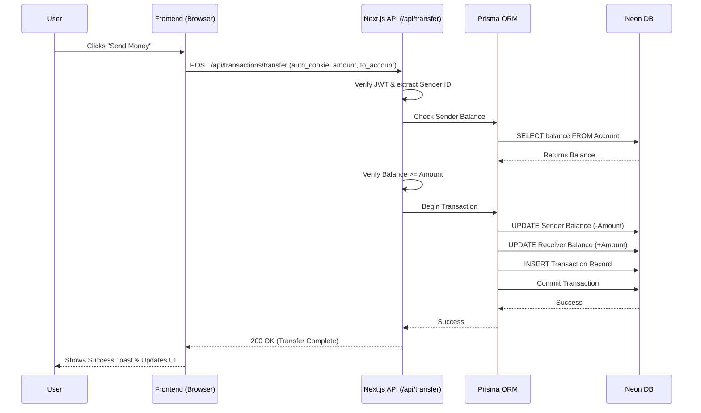

# NovaBank System Design & Project Documentation

## 1. Project Overview

**NovaBank** is a modern, full-stack banking web application designed as a Software Engineering Lab Project. It simulates a real-world digital banking experience, allowing users to register with full KYC (Know Your Customer) details, view their dashboard, and perform secure atomic transactions like credits, debits, and fund transfers.

The primary goal of the project was to build a secure, fast, and scalable web application utilizing the latest features in the React and Node.js ecosystems, specifically focusing on serverless deployments and strict type safety.

---

## 2. Technology Stack

We carefully selected a modern tech stack to ensure high performance, excellent developer experience, and robust security.

### Frontend (Client-Side)
*   **Next.js 15 (App Router)**: Used for its hybrid rendering capabilities (React Server Components + Client Components), allowing for fast initial page loads and highly interactive client-side features.
*   **Tailwind CSS**: A utility-first CSS framework used for rapid UI development. We implemented a custom "orange and warm white" design system with glassmorphism effects and micro-animations.
*   **React Hot Toast**: Used for lightweight, aesthetic push notifications and user feedback (e.g., "Transfer Successful").
*   **Lucide React**: For clean, modern SVG iconography.

### Backend (Server-Side)
*   **Next.js Route Handlers**: Serve as our RESTful API (`src/app/api/*`), handling all business logic, from account creation to transaction processing.
*   **Next.js Edge Middleware**: Used for route protection. It intercepts requests to protected routes (like `/dashboard`) and verifies authentication at the edge before hitting the server.
*   **Jose**: A zero-dependency library used for signing and verifying JSON Web Tokens (JWTs) securely in Edge environments.

### Database & ORM
*   **Neon PostgreSQL**: A serverless Postgres database provider. It scales down to zero when inactive and scales up instantly, making it perfect for serverless Next.js deployments.
*   **Prisma ORM**: A next-generation Node.js and TypeScript ORM. It provides strict type safety, auto-generated database clients, and easy schema migrations.

### Tooling & Infrastructure
*   **Bun**: Replaced npm as our ultra-fast JavaScript package manager and runtime, drastically speeding up dependency installation and script execution.
*   **TypeScript**: Used strictly across the entire codebase to catch errors at compile time and ensure end-to-end type safety from the database schema to the frontend props.

---

## 3. How We Built It (Development Journey)

1.  **Project Initialization & Cleanup**: 
    We started by analyzing the `.windsurfrules` constraints and the raw Next.js 15 template. We identified and cleaned up several anomalous directories (artifacts from failed bash brace-expansion commands) to ensure a clean `src/` directory structure.
2.  **Dependency & Configuration Fixes**: 
    We migrated the package manager from `npm` to `bun`. During this, we fixed a Next.js 15 configuration breaking change (moving `serverComponentsExternalPackages` out of the `experimental` object) and installed missing PostCSS plugins (`autoprefixer`) to ensure Tailwind compiled correctly.
3.  **Database Provisioning**: 
    We provisioned a serverless Neon DB instance. We then authored the `schema.prisma` file containing our core entities (`User`, `Account`, `Transaction`, `OtpStore`) and ran `prisma db push` to synchronize our cloud database with our local schema.
4.  **Core Feature Implementation**:
    *   **Auth**: Implemented JWTs stored in `httpOnly` cookies to protect against XSS, managed via Next.js Middleware.
    *   **Transactions**: Built the transaction engine using **Prisma `$transaction`** arrays to guarantee atomicity (e.g., if a debit succeeds but the corresponding credit fails, the entire transfer rolls back).
    *   **Admin Console**: Built a completely decoupled administrative portal with its own database model (`Admin`), separated JWT logic, and dedicated UI to manage users and monitor global transactions.
    *   **UI Polish**: Applied custom CSS (`.glass-card`, `.orange-gradient`) and hover animations to make the UI feel premium and dynamic.

---

## 4. System Architecture Diagram

```mermaid
flowchart TD
    %% Define Client Layer
    subgraph Client [1. Client Layer (Browser)]
        UI[Next.js Client Components\nTailwind CSS]
        Forms[React Hook Form / Fetch API]
    end

    %% Define Edge Layer
    subgraph Edge [2. Edge Layer]
        Middleware{Next.js Middleware\nRoute Protection}
    end

    %% Define Server Layer
    subgraph Server [3. Server Layer (Next.js Node/Edge)]
        RSC[React Server Components\nInitial Page Load]
        API[API Route Handlers\n/api/*]
        AuthUtils[Auth Utils\nJose JWT]
    end

    %% Define Data Access Layer
    subgraph DAL [4. Data Access Layer]
        Prisma[Prisma ORM Client]
    end

    %% Define Persistence Layer
    subgraph Database [5. Persistence Layer]
        Neon[(Neon PostgreSQL\nServerless DB)]
    end

    %% Define relationships
    UI -- "Interacts with" --> RSC
    UI -- "Sends HTTP Requests" --> Middleware
    Middleware -- "Validates JWT Token" --> AuthUtils
    Middleware -- "Passes Request" --> API
    Middleware -- "Redirects to Login" --> UI
    
    API -- "Business Logic & Validation" --> Prisma
    RSC -- "Direct DB Queries" --> Prisma
    
    Prisma -- "TCP / Connection Pool" --> Neon
```

---

## 5. Step-by-Step Data Flow

### Step 1: Client Layer (Browser/User Interface)
Handles user interactions, form submissions, and UI state (like modals and loading spinners). When a user fills out a form (e.g., transferring money), the Client Layer validates the inputs on the frontend and makes an asynchronous `fetch` request to the backend API.

### Step 2: Edge Layer (Routing & Security Middleware)
Acts as a gatekeeper for protected pages. Before a request reaches the dashboard or API, the Middleware intercepts it. It checks for the presence of the `auth_token` cookie. If the token is missing or invalid, it instantly redirects the user back to the `/auth/signin` page.

### Step 3: Server Layer (API Handlers & Server Components)
Handles business logic, data fetching, and security validations. 
*   **Page Load**: Server Components fetch initial data securely on the server and send fully rendered HTML to the client.
*   **API Request**: When the API receives a request, it extracts the JWT, validates the payload, and triggers the Data Access Layer.

### Step 4: Data Access Layer (ORM)
Translates TypeScript logic into secure SQL queries. To ensure financial accuracy, operations like money transfers are wrapped in a **Prisma `$transaction`**. This ensures operations happen simultaneously and safely.

### Step 5: Persistence Layer (Database)
Safely stores all permanent state.
*   **Users**: Bank customers with full KYC details, accounts, and hashed passwords.
*   **Admins**: Bank employees with restricted console access. Stored in an entirely isolated table from standard users to ensure strict security separation.
*   **Accounts**: Associated with users, tracks the master `balance`.
*   **Transactions**: An immutable ledger of every credit, debit, and transfer.

---

## 6. Example Flow: Money Transfer Sequence


